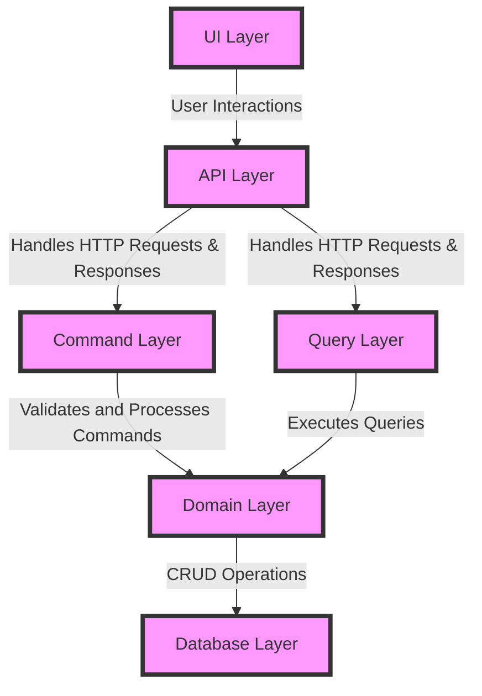

## Digital Account API

### Function Description

This microservice function, implemented in the `./api` directory, is designed to handle HTTP requests and responses. It
interacts with the service's underlying business logic and database operations to fulfill client requests. The function
receives input parameters, processes them according to the predefined logic, and returns the appropriate output in the
form of an HTTP response. Key responsibilities include:

- Validating and parsing incoming request data
- Interacting with the database to perform CRUD operations
- Implementing business logic for processing data
- Formatting and sending back HTTP responses

### Business Operations

This microservice focuses on managing bank digital accounts, including the following operations:

- **Create Accounts:** Facilitates the creation of new bank digital accounts by accepting user information and storing
  the details securely in the database.
- **Create Deposits:** Allows clients to deposit funds into their digital accounts by updating the account balance and
  recording the transaction.
- **Withdraw Funds:** Permits account holders to withdraw funds from their accounts, ensuring that sufficient balance is
  available and updating the account records accordingly.
- **Manage Accounts:** Supports the updating of account information and other management tasks such as account status
  changes, retrieving account details, and reviewing transaction history.

### More Information

For detailed API specifications, you can refer to the OpenAPI JSON file located in the `./api/src/main/resources` directory:
[OpenAPI Specification](./api/src/main/resources/ApiDescription.json)

### CQRS Architecture

The Digital Account API is implemented using the Command Query Responsibility Segregation (CQRS) architecture. CQRS is a
pattern that separates the processing of commands (writes) from queries (reads), ensuring scalability, flexibility, and
maintainability in complex applications.

#### Advantages of CQRS

1. **Scalability:** By segregating the read and write operations, CQRS allows to scale each side independently as per
   the requirements.
2. **Optimal Performance:** Read and write operations can be optimized differently, thus improving the overall
   performance of the system.
3. **Simplified Code Base:** It simplifies the domain logic by separating command processing from query handling, making
   the code easier to understand and maintain.
4. **Flexibility:** Allows the use of different models for reading and writing, which can be optimized for their
   respective concerns.
5. **Event Sourcing:** Paves the way for implementing event sourcing, which records all changes to an application state
   as a sequence of events, ensuring strong audit capabilities.

#### CQRS Architecture Layers



- **UI Layer:** This layer captures user interactions and sends requests to the API Layer.
- **API Layer:** This layer receives HTTP requests, validates them, and routes them to the appropriate Command or Query
  Layer.
- **Command Layer:** This layer handles command processing (CREATE, UPDATE, DELETE) by applying business logic and
  interacts with the underlying Domain Layer.
- **Query Layer:** This layer handles query processing (READ) by retrieving data via the Domain Layer.
- **Domain Layer:** This layer contains the business logic, ensuring that data interactions follow the business rules.
- **Database Layer:** This layer handles the CRUD operations with the database, maintaining the persistent storage of
  account data.

#### Argument for Choosing CQRS

The CQRS architecture was chosen for the Digital Account API because it effectively handles the complexity and
scalability requirements of managing digital banking operations. By separating read and write functionalities, it
provides a clear path for optimizing various aspects of the system independently. Additionally, it simplifies the
maintenance of the codebase and supports future growth, allowing for enhanced performance and flexibility.

#### References

- [Martin Fowler on CQRS](https://martinfowler.com/bliki/CQRS.html)
- [Microsoft Documentation on CQRS Pattern](https://docs.microsoft.com/en-us/azure/architecture/patterns/cqrs)
- [CQRS by Greg Young](https://cqrs.files.wordpress.com/2010/11/cqrs_documents.pdf)

### Use of Ktor and Kotlin

The Digital Account API utilizes Ktor as its framework and Kotlin as its programming language. Ktor is a modern and
lightweight web framework built specifically for Kotlin, which facilitates the creation of asynchronous servers and web
applications. Leveraging Kotlin’s expressive syntax and robust features, Ktor allows for intuitive code writing, making
it perfect for crafting scalable and maintainable microservices. The combination of Ktor and Kotlin provides a powerful
stack for developing server-side applications with high performance, concise code, and seamless integration with
existing tools and libraries.

#### Justification for Ktor and Kotlin

Choosing Ktor and Kotlin for the Digital Account API stack offers several advantages. Kotlin, known for its expressive
syntax and interoperability with Java, ensures that developers can write concise and readable code while leveraging
existing Java libraries. Its statically-typed nature adds an extra layer of safety, reducing runtime errors through
compile-time checks. Ktor, designed to work seamlessly with Kotlin, streamlines the process of building asynchronous web
applications, providing high performance while requiring minimal boilerplate code. This stack is particularly suitable
for microservices due to its support for coroutine-based concurrency, making it highly efficient for handling concurrent
connections.

### Links and References

- [Kotlin Documentation](https://kotlinlang.org/docs/home.html)
- [Ktor Documentation](https://ktor.io/docs/)
- [Ktor GitHub Repository](https://github.com/ktorio/ktor)
- [Modern Web Development with Kotlin and Ktor](https://kotlinlang.org/docs/ktor.html)

### Running the API Locally

To run the Digital Account API locally, follow the instructions below. Make sure you have Docker installed as it is a
dependency for running the service.

#### Prerequisites

1. **Docker:** The API uses Docker to manage its runtime environment. If you do not have Docker installed on your
   machine, you can follow the instructions from the [Docker Installation Guide](https://docs.docker.com/get-docker/).

#### Steps to Run the API

1. **Clone the Repository:** Clone the repository containing the Digital Account API to your local machine.
    ```sh
    git clone https://github.com/username/digital-account-api.git
    cd digital-account-api
    ```

2. **Run the API Script:** Execute the provided script to start the API.
    ```sh
    ./runLocalAPI.sh
    ```

   This script will perform the following tasks:
    - Build the Docker image for the API.
    - Create and run a Docker container based on the created image.

#### Testing the API with Postman

Postman is a powerful tool for testing APIs. Here are some tips for using Postman with the Digital Account API:

1. **Import the API Collection:** Download the Postman collection for the Digital Account API and import it into
   Postman. This collection will contain predefined requests that you can use to interact with the API.

2. **Set up the Environment:** Configure an environment in Postman to store variables such as the API endpoint. This
   will make it easier to switch between different environments (local, development, production).

3. **Send Requests:** Use the requests in the imported collection to interact with the API. You can perform operations
   such as creating accounts, making deposits, and withdrawing funds.

4. **Check Responses:** Postman allows you to view and analyze the API responses, making it easy to debug issues and
   verify that the API is working correctly.

- [Postman Documentation](https://learning.postman.com/docs/getting-started/introduction/)

By following these steps, you can set up and test the Digital Account API locally on your machine.

### Future Implementations

Currently, the route `/contas/extrato` is not implemented. This route is planned to be added in a future release and
will provide clients with the ability to retrieve account statements. The implementation will likely include features
such as filtering transactions by date range, viewing detailed transaction information, and exporting statements in
various formats. Stay tuned for updates on this feature.

### Choice of English Language

The README documentation for the Digital Account API is written in English to ensure broad accessibility and
universality. English is widely used as the primary language for technical documentation and software development,
allowing developers and users across different regions to understand and contribute to the project more effectively. By
using English, the documentation caters to a global audience, promoting inclusivity and collaboration from the
international development community.